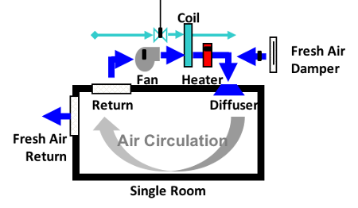

# Fan Coil Unit

## Overview
The Fan Coil Unit (FCU) aims to control the air temperature in a room through the use of several physical components and software controllers. Water is heated or cooled in a Heat Pump and flows to the Coil. A Fan blows air through the Coil. The air is heated or cooled depending upon the Coil temperature, and flows into the room.

A Controller is able to alter the fan speed and the rate of the water flow from the Heat Pump to the Coil. In addition, the room temperature is affected by the walls and windows, which constitute the environment of the FCU.
The aim of the system is to maintain a set temperature in the single room in which the FCU is located.

## Supported Features
This study supports the following INTO-CPS technologies:

* 20-Sim (for FMU)
* OpenModelica (for FMU)
* VDM-RT (for FMU)
* INTO-CPS SysML  
* Co-simulation Engine (COE)
* Design Space Exploration
* Test Automation
* Model Checking
* Code Generation

## Additional Information
Additional Information about this case study can be found in the [Examples Compendium](http://projects.au.dk/fileadmin/D3.5_Examples_Compendium_2.pdf#page=26)

Alternatively, contact the case study owner, [Carl Gamble](mailto:carl.gamble@ncl.ac.uk).
